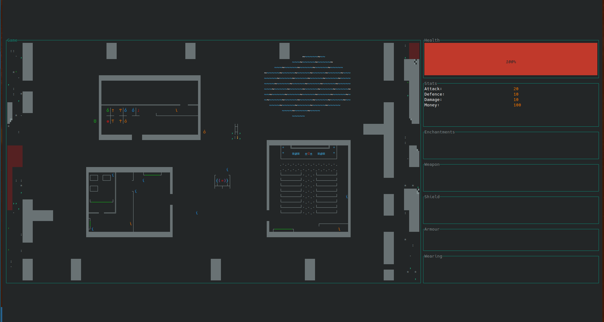
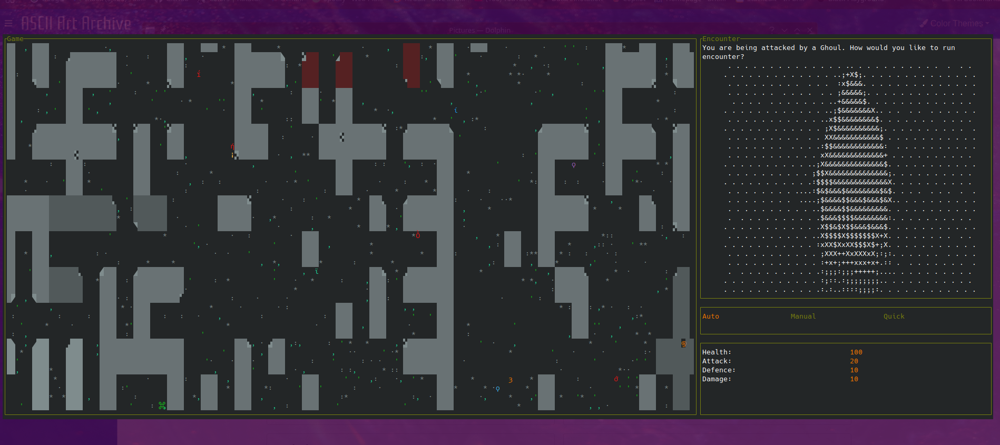

# The Caves: Search for the Obsidian Engine

Procedurally generated terminal RPG

The Caves are the remnants of the ever changing maze that was used to protect the ancient underground city of Obsidian. The city had an engine that they used to form and shift the passages in the vast cave system into an ever changing maze, protecting the city from intruders. The city is rumored to have been lost for ages, and the caves have become worn down in that time. Much of the ever changing maze persists, but many of the walls have deteriorated, leaving the caves easier to navigate.

Over the years, the caves have become inhabited by explorers and those looking for meaning in the caves. Many have settled in the ancient maze and established towns that spread throughout and provide support for those that explore the caves for resources and treasure. The towns generally have shops and a guild that support the exploration effort and distribute supplies throughout the settlements.

Some of the settlers have begun to worship the ancient caves, believing that the walls themselves contain an ancient power. They have churches that spread throughout the caves, providing the much of the social foundation to the people in the caves. They comunicate between the settlements, and provide spiritual support to the people who live there. They dont require patrons to join, and are more of a community center than an authoritarian body. However some are still wary.

Since the caves continue to shift and change, navigating between settlements can be difficult. The residents have developed compasses that can be attuned to anchors at each settlement. The compasses show the direction of the selected settlement, as the settlements themselves dont shift, as the walls around them do.



The game is currently in development, and is currently run using the rust `cargo run` command.

The project is built in Rust and will need to be installed in order to run the game.
Rust can be installed using the following command:

**Linux/macOS**

```
curl --proto '=https' --tlsv1.2 -sSf https://sh.rustup.rs | sh
```

**Windows**
[Follow instructions here](https://forge.rust-lang.org/infra/other-installation-methods.html)

To play the game use the following commands:

```
git clone https://github.com/daffyd-jones/rust_dungeon.git
cd rust_dungeon
cargo run
```


